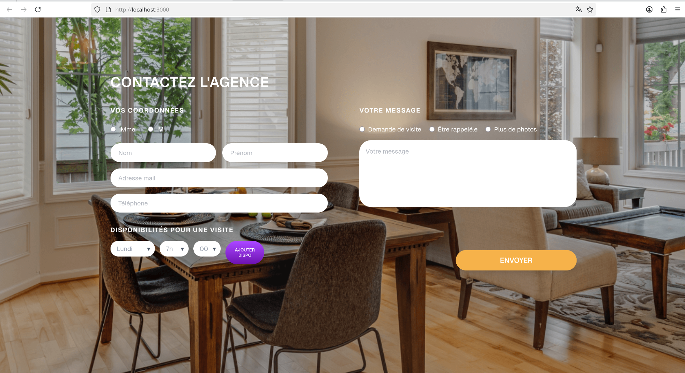
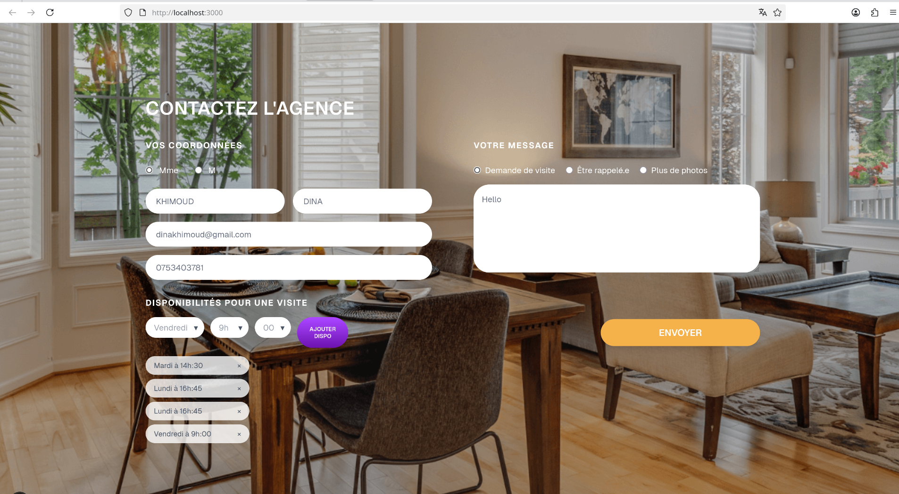
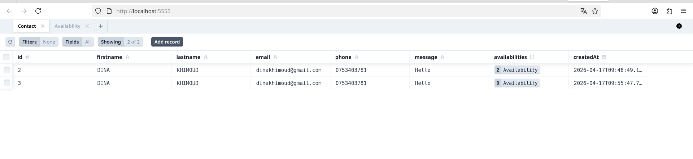
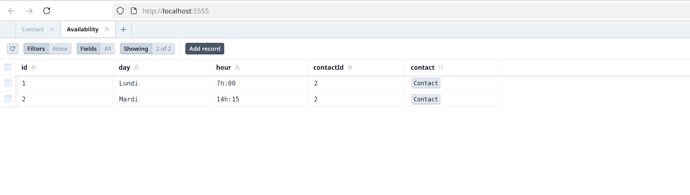
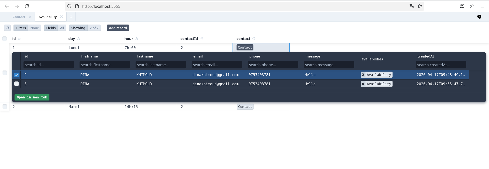

# 📌 Test Développeur Web – Majordhom

## 👩‍💻 À propos de moi

* **Nom / Prénom :** KHIMOUD Dina
* **Formation :** M1 Informatique, parcours Ingénierie du Logiciel Libre,  Moyenne académique : 14,15 (S1)
* **Établissement :** Université du Littoral Côte d’Opale Calais France,  (mobile sur Marseille – famille)
* **Durée de stage souhaitée :** 12 semaines (3 mois)

🔗 **Liens :**

* GitHub :    https://github.com/dina-khimoud-futuredev
* ce test :   https://github.com/dina-khimoud-futuredev/majordhom-test
* Portfolio : https://dina-khimoud-futuredev.github.io/portfolio/
* LinkedIn :  https://www.linkedin.com/in/dina-khimoud/

---

## 📸 Screenshots

### 🖥️ Interface utilisateur




---

### 🗄️ Base de données (Prisma / SQLite)





---

## ⚙️ Stack technique & choix

* **Next.js (React)**
  Framework fullstack permettant de gérer le frontend et le backend via les API routes.

* **React Hook Form**
  Permet une gestion simple, performante et optimisée des formulaires.

* **Tailwind CSS**
  Utilisé pour créer une interface moderne et fidèle à la maquette rapidement.

* **Prisma**
  ORM permettant de manipuler facilement la base de données avec un typage fort.

* **SQLite**
  Base de données légère, adaptée à un projet de test.

---

## 🚀 Lancement du projet

```bash
npm install
npx prisma migrate dev
npm run dev
```

Puis ouvrir dans le navigateur :

http://localhost:3000

---

## ❓ Questions

### ➤ Avez-vous trouvé l’exercice facile ou difficile ?

L’exercice était intéressant avec une difficulté progressive.
L’intégration de la maquette était accessible, mais la gestion du formulaire avec les disponibilités et la base de données a demandé plus de réflexion.

---

### ➤ Avez-vous appris de nouveaux outils ?

Oui, notamment **Prisma** pour la gestion de la base de données et **React Hook Form** pour améliorer la gestion du formulaire.

---

### ➤ Quelle est la place du développement web dans votre formation ?

Le développement web occupe une place importante dans ma formation, à travers des projets pratiques mêlant frontend et backend.

---

### ➤ Avez-vous utilisé un LLM ?

Oui, j’ai utilisé un LLM pour m’aider à comprendre certaines erreurs, structurer mon code et améliorer la qualité globale du projet, tout en veillant à bien comprendre les solutions proposées.
